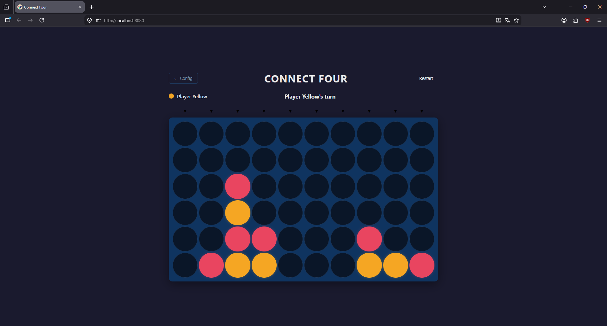

# Connect Four

A web-based Connect Four game built with [Compose HTML](https://github.com/JetBrains/compose-multiplatform/#compose-html) as part of a JetBrains internship assignment.

## Running the project

**Development server:**
```bash
./gradlew jsBrowserDevelopmentRun
```
Then open [localhost:8080](http://localhost:8080) in your browser.

**Unit tests** (runs on JVM, no browser needed):
```bash
./gradlew jvmTest
```

---

## Template
Project forked from template: [JetBrains template](https://github.com/JetBrains/compose-multiplatform-html-library-template)

## Features

- **Configurable board** — rows, columns, and win condition (connect N) are all set before each game via a config screen. Supported ranges: 4–20 rows/columns, connect 3–10.
- **Gravity mechanics** — pieces stack from the bottom of each column, standard Connect Four rules.
- **Win & draw detection** — detects horizontal, vertical, and both diagonal win conditions for any configured N. Draw is detected when the top row is fully occupied.
- **Winning streak highlight** — the exact cells forming the winning line are highlighted with a pulsing animation.
- **Game persistence** — mid-game state is saved to `localStorage` after every move. Refreshing the page restores the board exactly as it was. Finished games are not persisted.
- **Responsive layout** — the board scales from large desktop screens down to mobile using CSS Grid with `minmax` cell sizing. Tap targets meet minimum size requirements on touch screens.
- **Drop animation** — pieces animate into position using a CSS keyframe (`cubic-bezier` ease-in). No JavaScript animation libraries are used.

---

## Screenshot




---


## Architecture

The project is split into three layers with strict dependency rules: `model` and `game` have no Compose imports and no browser dependencies. Only `ui` and `storage` touch platform APIs.

### model/

Plain Kotlin data classes and enums with no dependencies. `GameState` is immutable — the board is `List<List<Cell>>` rather than a mutable array, so data class `equals()` works correctly and Compose's state diffing behaves as expected. `GameStatus` is a sealed class with three variants: `Playing`, `Won(player, winningCells)`, and `Draw`. The `winningCells: Set<Pair<Int, Int>>` carried by `Won` is used directly by the UI to highlight the streak without any additional computation at render time.

### game/GameEngine

A pure object with no side effects. Every function takes a `GameState` and returns a new `GameState` — nothing is mutated. This makes the engine straightforward to unit test and reason about.

Win detection runs only from the last dropped piece rather than scanning the whole board. For each of the four axis directions (horizontal, vertical, two diagonals), it walks outward in both directions from the dropped cell and counts consecutive matching cells. If the total in any axis reaches the configured win condition, it returns the coordinates of that streak. Because only the last move can produce a new win, this is correct by induction.

Draw detection checks only the top row — if every cell in row 0 is occupied, no further moves are possible regardless of the rest of the board.

### game/GameController

Holds `var state by mutableStateOf(...)` and exposes named action functions (`dropPiece`, `startGame`, `resetGame`, `goToConfig`). It is a plain class, not a `@Composable`. The Compose runtime propagates state changes to any composable that reads `controller.state` or `controller.screen` automatically. `GameStorage.save()` is called inside the controller after every state transition so the storage layer never needs to be aware of game rules.

### ui/

All styling is defined in a single `AppStyleSheet : StyleSheet()`. Class names are referenced as Kotlin properties (`AppStyleSheet.board`, `AppStyleSheet.cell`) rather than hardcoded strings, so renaming a style is a refactor-safe operation. The stylesheet is injected once via `Style(AppStyleSheet)` at the top of `renderComposable`.

The drop animation works by giving each `GameCell` a `key(cell)` block. When a piece lands, `cell` changes from `EMPTY` to `RED` or `YELLOW`, which changes the key, which causes Compose to unmount and remount the DOM element, which restarts the CSS `@keyframes dropIn` animation from the beginning. This requires no JavaScript — the browser handles the animation entirely.

### storage/GameStorage

Serialises `GameState` to a single `localStorage` string. The format is:

```
rows;cols;winCondition|currentPlayer|lastMoveRow;lastMoveCol|row0cell0,row0cell1,...|row1cell0,...
```

Cells are encoded as `0/1/2` for `EMPTY/RED/YELLOW`. The entire `load()` function is wrapped in a `try/catch` — any malformed or outdated value in storage is silently discarded and the app starts fresh. Finished games (`Won` or `Draw`) are not saved; `save()` calls `clear()` instead, so there is never a stale completed game waiting to be restored.

---

## Design decisions

**`List<List<Cell>>` over `Array<Array<Cell>>`**  
Kotlin's `Array` does not implement structural equality, so a `data class` containing an array will not correctly detect state changes. Using `List` means `GameState.equals()` works out of the box, which matters both for Compose recomposition and for test assertions.

**Win check from last move only**  
Scanning the entire board after every move is O(rows × cols × 4 × N). Checking only from the last dropped piece reduces this to O(N) per direction, which is always bounded by the win condition. For the supported board sizes this difference is negligible, but the approach is more correct algorithmically and scales to large boards without modification.

**Simple game state management**  
`GameController` uses `mutableStateOf` directly rather than `StateFlow` or a ViewModel. For a single-page browser app with synchronous game logic, the added infrastructure of a coroutine scope and flow collection would be complexity without benefit. Compose's snapshot state system is sufficient.

**Styling via `StyleSheet` only**  
All CSS is declared in `AppStyleSheet`. Inline `style { }` blocks are used only for dynamic values that depend on runtime state (e.g. `grid-template-columns` with a column count from config). This keeps the separation between structure and presentation clear and makes it easy to audit all visual decisions in one place.

**`GameStorage` in `jsMain` only**  
`kotlinx.browser.localStorage` is a JS-only API. Keeping `GameStorage` out of `commonMain` means the game engine and model remain fully testable on the JVM without any mocking or expect/actual indirection.

---

## Testing

Unit tests cover `GameEngine` exclusively, since it is the only layer with non-trivial logic. Tests run on the JVM via the `jvmTest` Gradle task.

Covered cases include: gravity and column stacking, turn alternation, horizontal/vertical/diagonal win detection, configurable win condition (connect 3, connect 5), winning cell coordinates, draw detection, ignoring moves after game over, and out-of-bounds column indices.

The `playMoves(vararg cols: Int)` test helper describes a game as a sequence of column drops, keeping individual test cases concise and readable.
